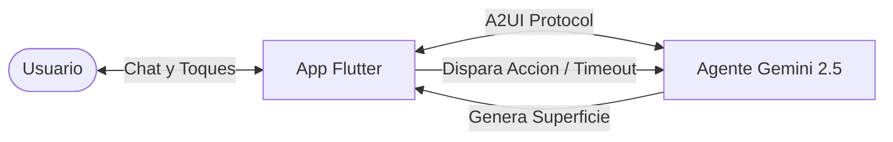

# Bienvenido a Intro to GenUI & A2UI

Bienvenido a la documentación técnica de **Intro to GenUI - Memory Trainer**, un proyecto de referencia desarrollado en Flutter que demuestra cómo implementar **A2UI (Agent-to-User Interface)** utilizando el paquete oficial [`genui`](https://pub.dev/packages/genui), modelos multimodales **Gemini** (a través de Firebase Vertex AI) y **Clean Architecture**.

---

## 🎯 ¿Qué es este proyecto?

El proyecto es un **Entrenador de Memoria interactivo impulsado por Inteligencia Artificial**. 

En lugar de ser un simple chatbot de texto, el agente de IA actúa como un coach cognitivo que:
1. **Entabla una conversación guiada**: Pregunta al usuario qué temática desea entrenar y cuántas palabras quiere memorizar.
2. **Genera interfaces visuales dinámicas (Surfaces)**: Despliega una tarjeta con un temporizador regresivo y las palabras a memorizar mediante un widget nativo de Flutter (`MemorySessionDisplay`).
3. **Reacciona a eventos temporales**: Cuando el temporizador finaliza en el dispositivo, la UI oculta las palabras automáticamente y despacha un evento nativo al agente informándole que el tiempo terminó.
4. **Evalúa respuestas individualmente**: Realiza una ronda de preguntas palabra por palabra calificando con puntaje semántico (`1.0`, `0.5`, `0.0`).
5. **Genera un reporte final enriquecido**: Despliega una segunda superficie nativa (`ScoreDisplay`) con barra de progreso, detalles de aciertos y un búho animado retro (`OwlPainter`) cuyo estado emocional refleja el rendimiento del usuario.

---

## 💡 El cambio de paradigma: De Chatbots de Texto a A2UI

En las interfaces conversacionales tradicionales (Chatbots clásicos), la interacción suele limitarse a intercambiar cadenas de texto o bloques Markdown:

* ❌ **Limitación del texto plano**: No permite temporizadores interactivos, botones de selección dinámica, formularios con validación, gráficos ni componentes nativos de la plataforma.
* ❌ **Markdown enriquecido es frágil**: Intentar incrustar HTML o sintaxis personalizada en Markdown es propenso a errores de renderizado y carece de vinculación bidireccional de estados.
* ❌ **Falta de control del desarrollador**: El modelo decide arbitrariamente cómo formatear la respuesta visual, sin respetar el sistema de diseño ni el catálogo de widgets de la aplicación.

### ¿Qué resuelve A2UI (Agent-to-UI / GenUI)?

**A2UI** es un protocolo y enfoque arquitectónico donde:

1. **El desarrollador define un catálogo cerrado de componentes (Catalog):** Cada componente (`CatalogItem`) tiene un esquema JSON estricto (`json_schema_builder`) que especifica sus propiedades y acciones permitidas.
2. **El agente de IA actúa como orquestador:** Conoce el esquema de los componentes y, en lugar de generar código o HTML libre, emite un objeto JSON estructurado que indica: *"Renderiza el componente `MemorySessionDisplay` con estas palabras y 60 segundos de duración"*.
3. **El cliente Flutter renderiza widgets nativos:** El framework GenUI intercepta el payload, valida que cumpla con el esquema y crea la superficie visual (`Surface`) utilizando widgets reales de Flutter (`Card`, `LinearProgressIndicator`, animaciones, etc.).
4. **La interacción es bidireccional:** Cuando el usuario interactúa con la UI (o transcurre un temporizador), la superficie despacha un `UserActionEvent` que se traduce de vuelta en un mensaje para el agente.

---

## 🧩 Conceptos clave de A2UI en Flutter

| Concepto | Rol en la arquitectura | Archivo de referencia en el proyecto |
|---|---|---|
| **JSON Schema** | Contrato declarativo que define los campos requeridos y tipos aceptados por la UI. | [`memory_session_display.dart`](file:///Users/danielherrerasanchez/develop/gen_ui_flutter_med_fest/intro_to_genui/lib/ui/widgets/memory_session_display.dart#L9-L35) |
| **CatalogItem** | Enlace entre un nombre de componente, su esquema y el builder del widget Flutter. | [`buildMemorySessionDisplay(...)`](file:///Users/danielherrerasanchez/develop/gen_ui_flutter_med_fest/intro_to_genui/lib/ui/widgets/memory_session_display.dart#L268-L305) |
| **Catalog** | Registro central de todas las superficies disponibles que se expone al agente. | [`memory_trainer_page.dart`](file:///Users/danielherrerasanchez/develop/gen_ui_flutter_med_fest/intro_to_genui/lib/ui/pages/memory_trainer_page.dart#L68-L78) |
| **SurfaceController** | Controlador de GenUI que administra el estado y ciclo de vida de las superficies activas. | [`memory_trainer_page.dart`](file:///Users/danielherrerasanchez/develop/gen_ui_flutter_med_fest/intro_to_genui/lib/ui/pages/memory_trainer_page.dart#L80) |
| **A2uiTransportAdapter** | Adaptador que conecta el flujo conversacional de GenUI con el cliente LLM (`ChatSession`). | [`memory_trainer_page.dart`](file:///Users/danielherrerasanchez/develop/gen_ui_flutter_med_fest/intro_to_genui/lib/ui/pages/memory_trainer_page.dart#L81) |
| **UserActionEvent** | Evento emitido desde un widget Flutter que viaja al agente para continuar el flujo. | [`memory_session_display.dart`](file:///Users/danielherrerasanchez/develop/gen_ui_flutter_med_fest/intro_to_genui/lib/ui/widgets/memory_session_display.dart#L294-L300) |

---

## 🚀 Requisitos previos

Para aprovechar al máximo esta documentación y replicar la solución, es recomendable tener:
* Conocimientos básicos de **Flutter** y **Dart 3.x**.
* Conocimiento elemental sobre cómo funcionan las llamadas a APIs de LLMs (Google Gemini / Vertex AI).
* Familiaridad con el concepto de **Clean Architecture** (separación en capas de Dominio, Infraestructura, Configuración y UI).
