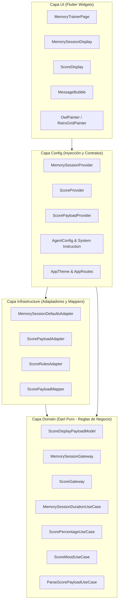

# Visión General de la Arquitectura

Uno de los mayores desafíos al implementar Inteligencia Artificial Generativa en aplicaciones móviles es la **imprevisibilidad de las respuestas de los modelos de lenguaje (LLMs)**. Si conectamos directamente las cargas útiles (payloads) de JSON generadas por la IA con los widgets de Flutter, la aplicación se vuelve frágil ante campos ausentes, tipos numéricos inesperados o alucinaciones leves.

Para solucionar esto, el proyecto utiliza una variante práctica y desacoplada de **Clean Architecture** estructurada en 4 capas estrictas:

```text
UI  ──>  Config  ──>  Infrastructure  ──>  Domain
```

---

## 🏗️ Diagrama de Dependencias



---

## 📂 Desglose por Capa

### 1. Capa Domain (`lib/domain/`)
Es el núcleo del sistema y está escrito en **Dart puro**, sin dependencias de Flutter, Firebase ni bibliotecas externas.

* **Modelos (`domain/models/`)**: Entidades inmutables y tipadas, como [`ScoreDisplayPayloadModel`](file:///Users/danielherrerasanchez/develop/gen_ui_flutter_med_fest/intro_to_genui/lib/domain/models/score/score_display_payload_model.dart) y `ScoreDisplayEntryModel`.
* **Puertas de enlace (Gateways) (`domain/models/.../gateway/`)**: Contratos abstractos que definen qué operaciones debe cumplir la infraestructura (por ejemplo, cálculo de duración o determinación del ánimo del búho).
* **Casos de Uso (`domain/usecase/`)**: Lógica pura de negocio independiente del framework. Ejemplos:
  * `MemorySessionDurationUseCase`: Valida o calcula los segundos de memorización según la cantidad de palabras (6 segundos por palabra).
  * `ScorePercentageUseCase`: Calcula el porcentaje de efectividad de las respuestas.
  * `ScoreMoodUseCase`: Determina si el búho debe estar celebrando (`celebrating`) o triste (`sad`) según si se alcanzó el 70% o más de aciertos.

### 2. Capa Infrastructure (`lib/infrastructure/`)
Implementa los contratos de la capa Domain y aísla la volatilidad de los datos externos provenientes del LLM.

* **Mappers (`infrastructure/helpers/mappers/`)**: Funciones defensivas como [`scorePayloadToModel`](file:///Users/danielherrerasanchez/develop/gen_ui_flutter_med_fest/intro_to_genui/lib/infrastructure/helpers/mappers/score_payload_mapper.dart), encargadas de transformar un `Map<String, Object?>` de JSON sin tipar a entidades de Dominio seguras, tolerando campos nulos o conversiones numéricas entre `int` y `double`.
* **Adaptadores conducidos (Driven Adapters) (`infrastructure/driven_adapters/`)**: Implementan los Gateways del dominio proveyendo valores por defecto y reglas de fallback si el LLM no envió un parámetro opcional.

### 3. Capa Config (`lib/config/`)
Conecta la infraestructura con la interfaz y define la configuración del agente de IA:

* **Providers (`config/providers/`)**: Unidades ligeras de inyección de dependencias (`MemorySessionProvider`, `ScoreProvider`, `ScorePayloadProvider`) que exponen los casos de uso a los widgets.
* **Configuración del Agente (`config/agent/agent_config.dart`)**: Define el modelo utilizado (`gemini-2.5-flash`), los IDs únicos de superficie (`memory_session`, `memory_score`), el saludo inicial y el prompt del sistema (`memoryTrainerSystemInstruction`).
* **Firebase Options y Rutas (`config/firebase/`, `config/routes/`)**: Inicialización centralizada de Firebase y navegación.

### 4. Capa UI (`lib/ui/`)
Contiene los elementos visuales de Flutter:

* **Páginas (`ui/pages/`)**: [`MemoryTrainerPage`](file:///Users/danielherrerasanchez/develop/gen_ui_flutter_med_fest/intro_to_genui/lib/ui/pages/memory_trainer_page.dart), que aloja la conversación, el `SurfaceController` y el `A2uiTransportAdapter`.
* **Superficies y Widgets (`ui/widgets/`)**:
  * `MemorySessionDisplay`: Widget de memorización con cuenta regresiva.
  * `ScoreDisplay`: Widget de presentación de resultados finales.
  * `MessageBubble`: Burbuja de chat para mensajes de texto intercambiados entre el usuario y el agente.
* **Pintores personalizados (`ui/painters/`)**: `OwlPainter` (gráfico vectorial dibujado en Canvas con diferentes expresiones), `RetroGridPainter` y `OrbPainter`.

---

## 🛡️ ¿Por qué esta arquitectura es ideal para A2UI?

1. **Tolerancia a fallos**: Si Gemini genera una propiedad con un nombre ligeramente erróneo o un tipo de dato flotante en lugar de entero, el mapper y el adaptador de la infraestructura lo normalizan antes de que llegue al widget.
2. **Reutilización y testeabilidad**: Los casos de uso y adaptadores pueden probarse con tests unitarios simples sin necesidad de levantar el árbol de widgets de Flutter ni realizar llamadas reales a la red.
3. **Escalabilidad de superficies**: Agregar una nueva superficie de UI en el futuro requiere únicamente:
   * Declarar su esquema JSON.
   * Crear el modelo y mapper correspondiente.
   * Registrar el `CatalogItem` en el catálogo de GenUI.
