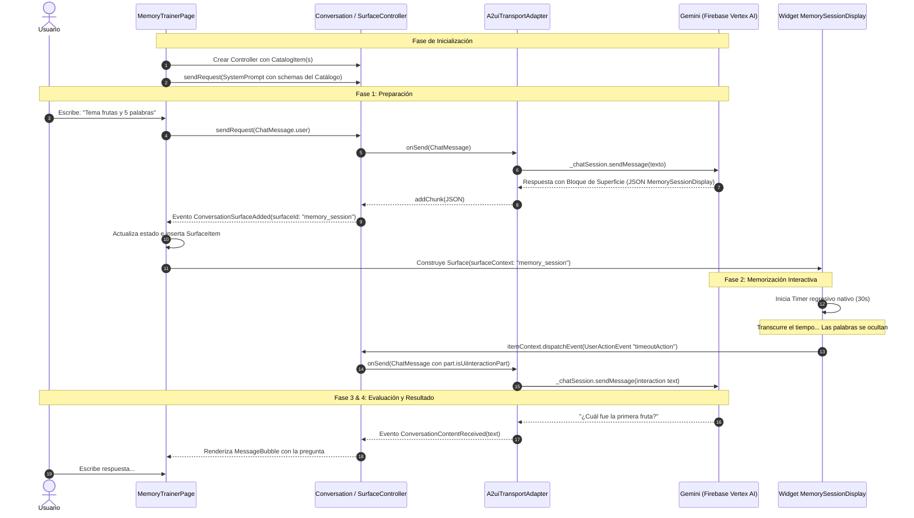

# Ciclo de Vida del Protocolo A2UI

El protocolo **A2UI (Agent-to-User Interface)** gestiona la sincronización entre el modelo generativo en la nube y el árbol de widgets nativos en Flutter. A diferencia de las llamadas convencionales de una sola vía (Request/Response), A2UI establece un **bucle conversacional e interactivo continuo**.

---

## 🔄 Diagrama de Secuencia Completo

A continuación se ilustra el ciclo de vida completo desde que el usuario inicia la sesión hasta que el temporizador nativo avisa al agente para comenzar la evaluación:



---

## 🔍 Detalle Paso a Paso de las Etapas

### 1. Inyección de Esquemas en el System Prompt
Al iniciar la pantalla, `PromptBuilder.chat` inspecciona todos los `CatalogItem` registrados en el `Catalog` y combina sus esquemas JSON con las instrucciones de la persona (`memoryTrainerSystemInstruction`):

```dart
final PromptBuilder promptBuilder = PromptBuilder.chat(
  catalog: _catalog,
  systemPromptFragments: [memoryTrainerSystemInstruction],
);

_conversation.sendRequest(
  ChatMessage.system(promptBuilder.systemPromptJoined()),
);
```

Esto enseña a Gemini exactamente cuáles componentes visuales tiene a su disposición, qué propiedades exige cada uno y cómo debe formatear la invocación.

---

### 2. Detección y Emisión de Superficies
Cuando el usuario envía su requerimiento, Gemini decide si responder con texto conversacional normal o emitir una superficie. Si emite una superficie, el adaptador `A2uiTransportAdapter` recibe el bloque de texto/JSON y la clase `Conversation` emite un evento `ConversationSurfaceAdded`:

```dart
_conversation.events.listen((event) {
  setState(() {
    switch (event) {
      case ConversationSurfaceAdded added:
        _items.removeWhere(
          (item) => item is SurfaceItem && item.surfaceId == added.surfaceId,
        );
        _items.add(
          SurfaceItem(
            surfaceId: added.surfaceId,
            instanceVersion: ++_nextSurfaceInstanceVersion,
          ),
        );
      case ConversationContentReceived content:
        _items.add(TextItem(text: content.text, isUser: false));
      // ...
    }
  });
});
```

---

### 3. Renderizado del Widget Reactivo (`Surface`)
En la lista de mensajes de la interfaz, los elementos de tipo `SurfaceItem` se dibujan utilizando el widget `Surface` provisto por `package:genui`:

```dart
Surface(
  key: ValueKey('${item.surfaceId}_${item.instanceVersion}'),
  surfaceContext: _controller.contextFor(item.surfaceId),
)
```

El `SurfaceController` localiza el builder correspondiente en el catálogo (`buildMemorySessionDisplay`), valida el payload JSON y construye el widget con sus providers inyectados.

---

### 4. Despacho de Eventos de Vuelta al Agente (Bucle Cerrado)
Cuando el temporizador del widget llega a cero, el widget ejecuta:

```dart
itemContext.dispatchEvent(
  UserActionEvent(
    name: timeoutAction.actionName,
    sourceComponentId: itemContext.id,
    context: resolvedContext,
  ),
);
```

Este evento llega a la función `_sendAndReceive` a través de `A2uiTransportAdapter`. La función detecta `part.isUiInteractionPart` y reenvía la interacción al modelo:

```dart
for (final part in msg.parts) {
  if (part.isUiInteractionPart) {
    buffer.write(part.asUiInteractionPart!.interaction);
  } else if (part is genui.TextPart) {
    buffer.write(part.text);
  }
}
await _chatSession.sendMessage(Content.text(buffer.toString()));
```

**Resultado:** El agente de IA sabe que el tiempo de memorización ha terminado de forma autónoma, sin requerir que el usuario escriba nada. Inmediatamente genera el primer turno de la fase de evaluación.
