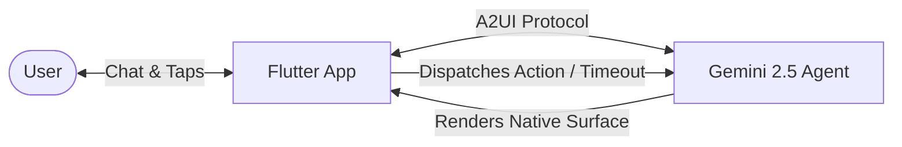

# Welcome to Intro to GenUI & A2UI

Welcome to the technical documentation for **Intro to GenUI - Memory Trainer**, a production-grade Flutter reference project demonstrating how to implement **A2UI (Agent-to-User Interface)** using the official [`genui`](https://pub.dev/packages/genui) package, **Google Gemini** multimodal models (via Firebase Vertex AI), and **Clean Architecture**.

---

## 🎯 What is this project?

This project is an **interactive, AI-powered Memory Coach**.

Rather than being a plain text chatbot, the AI agent acts as a cognitive coach that:
1. **Drives a guided conversational workflow**: Asks the user for a study topic and word count.
2. **Generates dynamic visual interfaces (Surfaces)**: Renders a timed memory card with a countdown clock and word chips using a native Flutter widget (`MemorySessionDisplay`).
3. **Responds to hardware/temporal events**: When the device timer expires, the UI automatically conceals the words and dispatches a native event back to the agent notifying it that memorization time is over.
4. **Evaluates answers step-by-step**: Conducts a word-by-word evaluation round granting semantic partial credit (`1.0`, `0.5`, `0.0`).
5. **Renders an enriched final score dashboard**: Displays a second native surface (`ScoreDisplay`) featuring a progress bar, per-word feedback, and a retro Canvas-drawn owl (`OwlPainter`) whose emotional mood reflects user performance.

---

## 💡 The Paradigm Shift: From Text Bots to A2UI

In traditional conversational interfaces, interactions are restricted to exchanging raw strings or Markdown fragments:

* ❌ **Plain text is non-interactive**: It cannot render live countdown timers, interactive forms, validation widgets, or native animations.
* ❌ **Embedded Markdown is brittle**: Attempting to embed HTML or custom tokens inside Markdown causes parsing errors, security risks, and lacks two-way state binding.
* ❌ **Lack of developer control**: The LLM arbitrarily decides how to format visual elements, breaking design systems and platform consistency.

### How A2UI (Agent-to-UI / GenUI) Solves This

**A2UI** is a protocol and architecture where:

1. **The developer defines a strict UI Catalog:** Each component (`CatalogItem`) is declared with an OpenAPI-compatible JSON Schema (`json_schema_builder`) defining allowed properties and events.
2. **The AI agent acts as the workflow orchestrator:** It knows the schema contract and, instead of generating arbitrary code or HTML, outputs a structured JSON block: *"Render `MemorySessionDisplay` with these words and a 60-second timer"*.
3. **Flutter renders native platform widgets:** The `genui` engine intercepts the payload, validates it against the schema, and builds native Flutter widgets (`Card`, `LinearProgressIndicator`, Canvas painters).
4. **Interaction is bidirectional:** When the user interacts with the UI (or an internal timer completes), the surface dispatches a `UserActionEvent` that turns into a native input for the AI agent.

---

## 🧩 Key A2UI Concepts in Flutter

| Concept | Role in Architecture | Reference File |
|---|---|---|
| **JSON Schema** | Declarative contract specifying accepted types and required properties for the surface. | [`memory_session_display.dart`](file:///Users/danielherrerasanchez/develop/gen_ui_flutter_med_fest/intro_to_genui/lib/ui/widgets/memory_session_display.dart#L9-L35) |
| **CatalogItem** | Link binding a component name, its JSON schema, and the Flutter widget builder. | [`buildMemorySessionDisplay(...)`](file:///Users/danielherrerasanchez/develop/gen_ui_flutter_med_fest/intro_to_genui/lib/ui/widgets/memory_session_display.dart#L268-L305) |
| **Catalog** | The registry of all available UI surfaces exposed to the agent. | [`memory_trainer_page.dart`](file:///Users/danielherrerasanchez/develop/gen_ui_flutter_med_fest/intro_to_genui/lib/ui/pages/memory_trainer_page.dart#L68-L78) |
| **SurfaceController** | GenUI controller managing active surface instances and state contexts. | [`memory_trainer_page.dart`](file:///Users/danielherrerasanchez/develop/gen_ui_flutter_med_fest/intro_to_genui/lib/ui/pages/memory_trainer_page.dart#L80) |
| **A2uiTransportAdapter** | Bridge connecting the GenUI conversational loop with the LLM client (`ChatSession`). | [`memory_trainer_page.dart`](file:///Users/danielherrerasanchez/develop/gen_ui_flutter_med_fest/intro_to_genui/lib/ui/pages/memory_trainer_page.dart#L81) |
| **UserActionEvent** | Event dispatched from a Flutter widget back to the AI model to resume execution. | [`memory_session_display.dart`](file:///Users/danielherrerasanchez/develop/gen_ui_flutter_med_fest/intro_to_genui/lib/ui/widgets/memory_session_display.dart#L294-L300) |

---

## 🚀 Prerequisites

To get the most out of this guide:
* Basic familiarity with **Flutter** and **Dart 3.x**.
* Fundamental understanding of LLM APIs (Google Gemini / Vertex AI).
* Basic knowledge of **Clean Architecture** (Domain, Infrastructure, Config, and UI layers).
