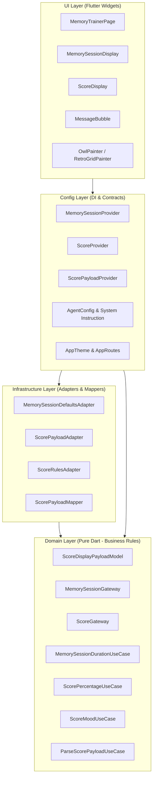

# Architecture Overview

One of the largest hurdles when integrating Generative AI into client-side Flutter applications is the **inherent volatility of LLM outputs**. If raw JSON payloads generated by Gemini are piped directly into Flutter widgets, apps become fragile to missing keys, numeric type discrepancies (such as floats vs integers), or subtle hallucinations.

To mitigate this, the project applies a tailored, decoupled **Clean Architecture** structured into 4 strict layers:

```text
UI  ──>  Config  ──>  Infrastructure  ──>  Domain
```

---

## 🏗️ Dependency Graph



---

## 📂 Layer Breakdown

### 1. Domain Layer (`lib/domain/`)
The foundational core written in **pure Dart**, with 0 dependencies on Flutter, Firebase, or third-party packages.

* **Models (`domain/models/`)**: Immutable and typed entities, such as [`ScoreDisplayPayloadModel`](file:///Users/danielherrerasanchez/develop/gen_ui_flutter_med_fest/intro_to_genui/lib/domain/models/score/score_display_payload_model.dart) and `ScoreDisplayEntryModel`.
* **Gateways (`domain/models/.../gateway/`)**: Abstract interfaces declaring required operational contracts (e.g. resolving session defaults or determining emotional mood).
* **Use Cases (`domain/usecase/`)**: Framework-agnostic business logic:
  * `MemorySessionDurationUseCase`: Computes memorization seconds based on word count (6 seconds per word).
  * `ScorePercentageUseCase`: Calculates accuracy percentages.
  * `ScoreMoodUseCase`: Determines whether the retro owl is celebrating or sad based on a 70% threshold.

### 2. Infrastructure Layer (`lib/infrastructure/`)
Implements Domain gateways and shields the application from unstructured LLM data.

* **Mappers (`infrastructure/helpers/mappers/`)**: Defensive parsing functions like [`scorePayloadToModel`](file:///Users/danielherrerasanchez/develop/gen_ui_flutter_med_fest/intro_to_genui/lib/infrastructure/helpers/mappers/score_payload_mapper.dart) that convert untyped JSON (`Map<String, Object?>`) into safe domain entities, gracefully handling null values and num-to-double conversions.
* **Driven Adapters (`infrastructure/driven_adapters/`)**: Concrete implementations providing fallback defaults if Gemini omits optional fields.

### 3. Config Layer (`lib/config/`)
Binds infrastructure with the UI and holds AI agent specifications:

* **Providers (`config/providers/`)**: Lightweight dependency injection units (`MemorySessionProvider`, `ScoreProvider`, `ScorePayloadProvider`) exposing use cases to widgets.
* **Agent Config (`config/agent/agent_config.dart`)**: Holds the model name (`gemini-2.5-flash`), unique surface IDs (`memory_session`, `memory_score`), initial greeting, and the prompt instruction (`memoryTrainerSystemInstruction`).
* **Firebase Options & Routes (`config/firebase/`, `config/routes/`)**: Platform initialization and navigation.

### 4. UI Layer (`lib/ui/`)
Contains all user-facing Flutter presentation widgets:

* **Pages (`ui/pages/`)**: [`MemoryTrainerPage`](file:///Users/danielherrerasanchez/develop/gen_ui_flutter_med_fest/intro_to_genui/lib/ui/pages/memory_trainer_page.dart), which coordinates the chat timeline, `SurfaceController`, and `A2uiTransportAdapter`.
* **Surfaces & Widgets (`ui/widgets/`)**:
  * `MemorySessionDisplay`: Timed memorization card.
  * `ScoreDisplay`: Evaluation dashboard with score bars.
  * `MessageBubble`: Standard conversational chat bubble.
* **Custom Painters (`ui/painters/`)**: Canvas-drawn artwork including `OwlPainter`, `RetroGridPainter`, and `OrbPainter`.

---

## 🛡️ Why Clean Architecture is Crucial for A2UI

1. **Fault Tolerance**: If Gemini outputs an unexpected key or sends an integer instead of a float, infrastructure mappers normalize the data before it touches UI widgets.
2. **Testability**: Use cases and mappers can be unit tested without spinning up Flutter widgets or making real network calls.
3. **Extensibility**: Adding a new interactive surface only requires defining its JSON schema, domain model, and registering its `CatalogItem`.
