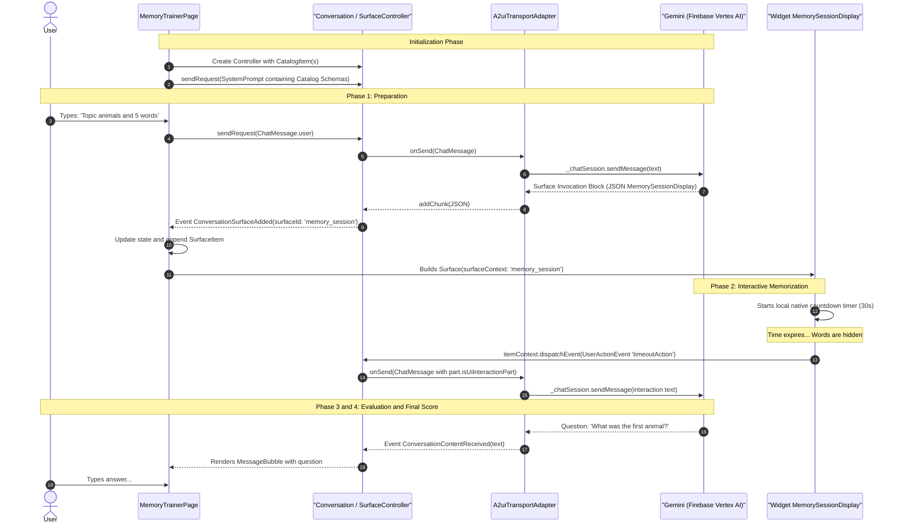

# A2UI Protocol & Execution Lifecycle

The **A2UI (Agent-to-User Interface)** protocol synchronizes the generative AI model in the cloud with the native Flutter widget tree on the device. Unlike traditional one-way Request/Response architectures, A2UI establishes a **continuous, state-aware conversational loop**.

---

## 🔄 End-to-End Sequence Diagram

The following sequence illustrates the entire lifecycle from user kickoff to automated native timer callback:



---

## 🔍 Detailed Phase Breakdown

### 1. Schema Injection into System Prompt
When the page mounts, `PromptBuilder.chat` inspects all registered `CatalogItem` definitions and combines their JSON schemas with system guidelines (`memoryTrainerSystemInstruction`):

```dart
final PromptBuilder promptBuilder = PromptBuilder.chat(
  catalog: _catalog,
  systemPromptFragments: [memoryTrainerSystemInstruction],
);

_conversation.sendRequest(
  ChatMessage.system(promptBuilder.systemPromptJoined()),
);
```

This gives Gemini precise knowledge of available UI components, required keys, and formatting rules.

---

### 2. Surface Detection & Event Emission
When the user sends their request, Gemini chooses whether to output standard text or emit a UI surface. When it outputs a surface, `A2uiTransportAdapter` buffers the JSON stream and `Conversation` emits a `ConversationSurfaceAdded` event:

```dart
_conversation.events.listen((event) {
  setState(() {
    switch (event) {
      case ConversationSurfaceAdded added:
        _items.removeWhere(
          (item) => item is SurfaceItem && item.surfaceId == added.surfaceId,
        );
        _items.add(
          SurfaceItem(
            surfaceId: added.surfaceId,
            instanceVersion: ++_nextSurfaceInstanceVersion,
          ),
        );
      case ConversationContentReceived content:
        _items.add(TextItem(text: content.text, isUser: false));
      // ...
    }
  });
});
```

---

### 3. Native Widget Rendering (`Surface`)
Inside the conversation ListView, elements of type `SurfaceItem` are rendered using the `Surface` widget:

```dart
Surface(
  key: ValueKey('${item.surfaceId}_${item.instanceVersion}'),
  surfaceContext: _controller.contextFor(item.surfaceId),
)
```

`SurfaceController` retrieves the appropriate catalog builder (`buildMemorySessionDisplay`), validates incoming JSON, and builds native Flutter widgets.

---

### 4. Dispatching Events Back to the Agent (Closed Loop)
When the countdown expires, the widget dispatches:

```dart
itemContext.dispatchEvent(
  UserActionEvent(
    name: timeoutAction.actionName,
    sourceComponentId: itemContext.id,
    context: resolvedContext,
  ),
);
```

This event reaches `_sendAndReceive` via `A2uiTransportAdapter`. The adapter flags `part.isUiInteractionPart` and routes the interaction back to Gemini:

```dart
for (final part in msg.parts) {
  if (part.isUiInteractionPart) {
    buffer.write(part.asUiInteractionPart!.interaction);
  } else if (part is genui.TextPart) {
    buffer.write(part.text);
  }
}
await _chatSession.sendMessage(Content.text(buffer.toString()));
```

**Result:** The AI model is informed that memorization time is over without any typing required from the user, immediately triggering the evaluation phase.
